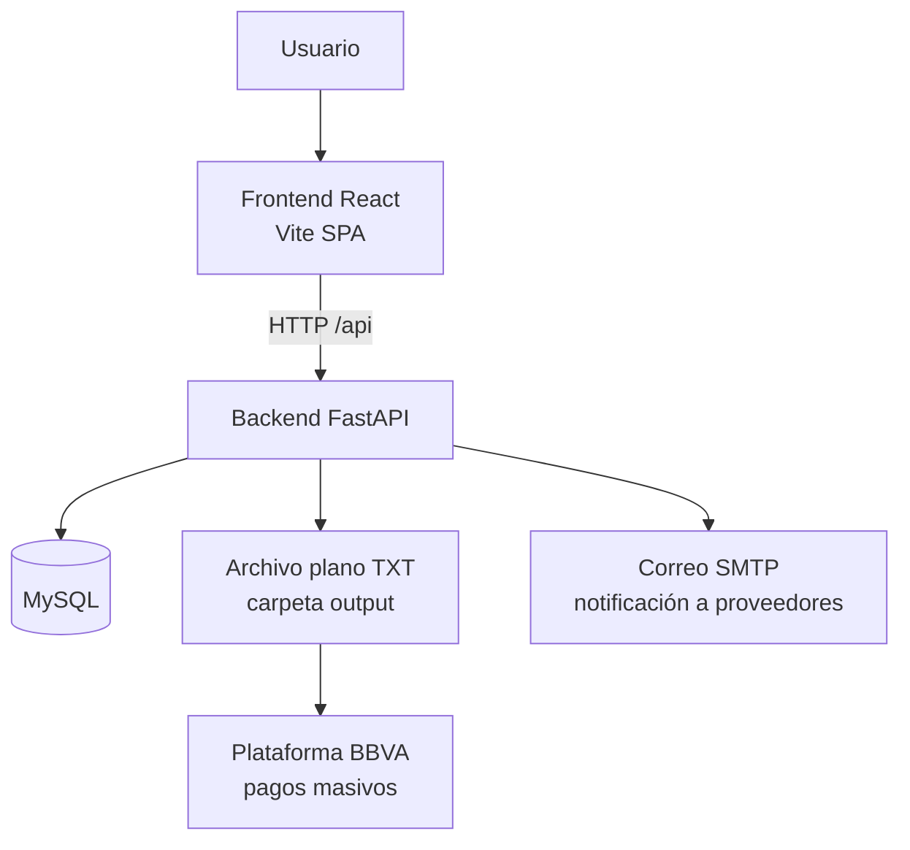
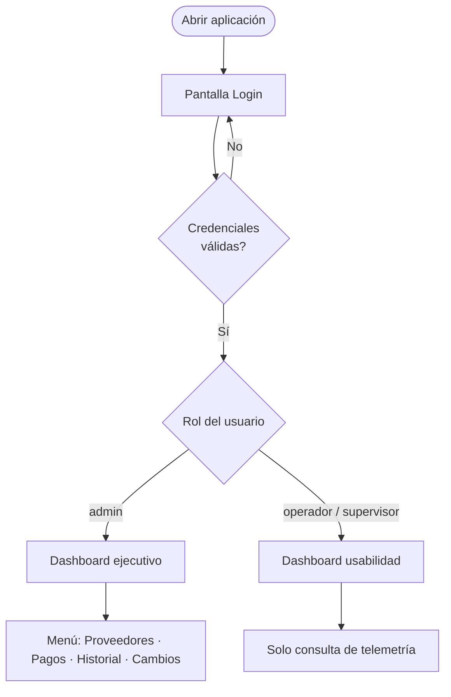
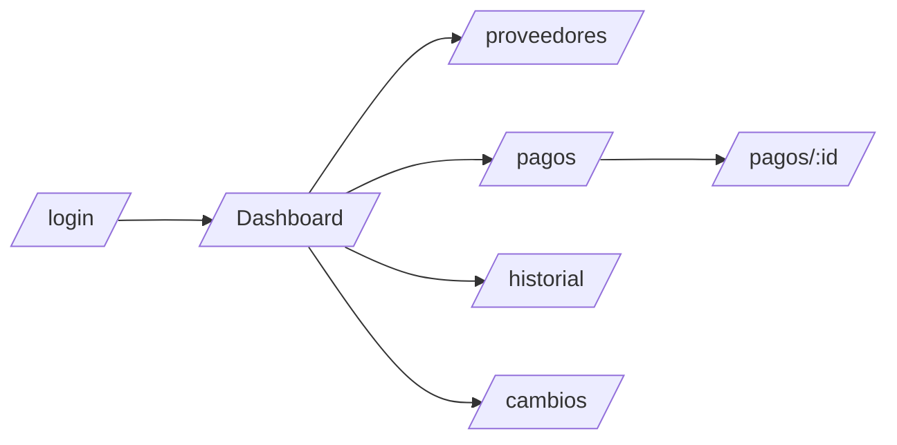
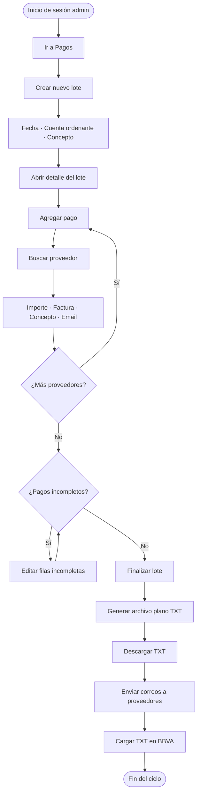
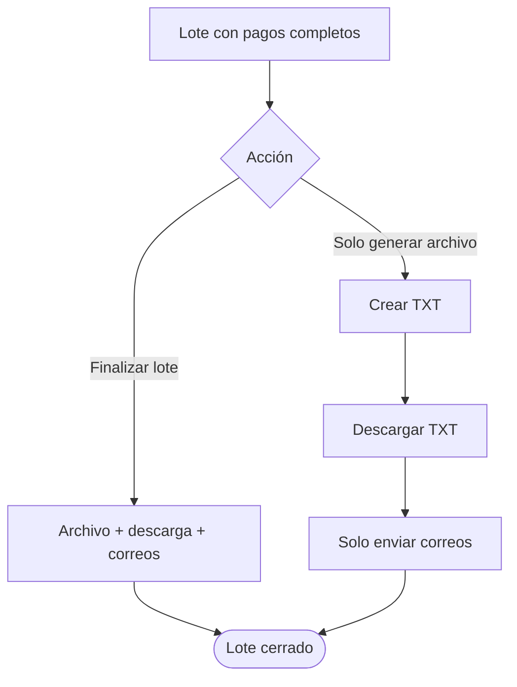
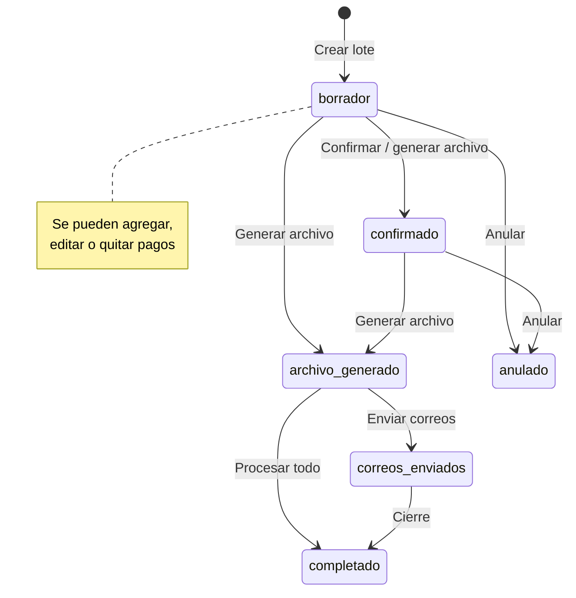
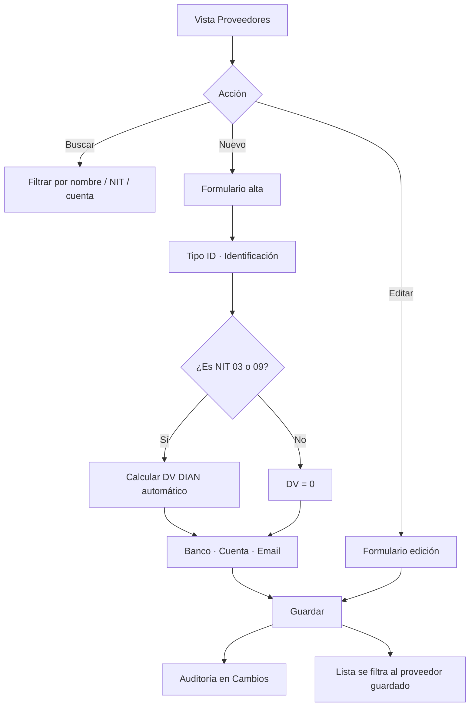
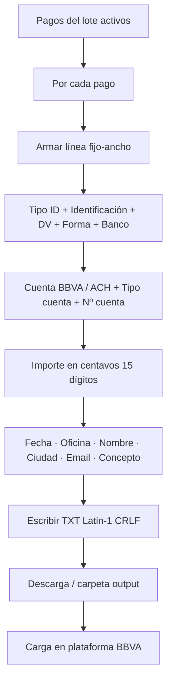
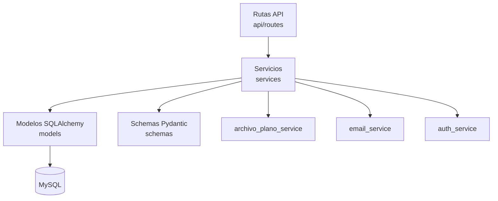
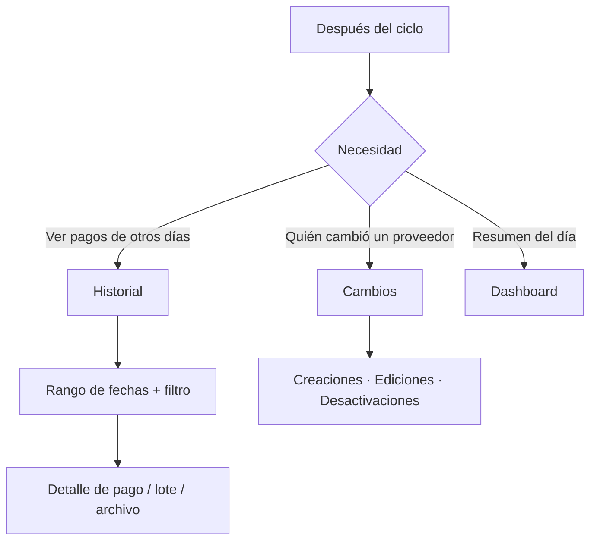

# Diagramas de flujo — Pago Proveedores Colbeef

Documentación visual del sistema. Los diagramas usan [Mermaid](https://mermaid.js.org/) y se ven en GitHub, Cursor, VS Code y [mermaid.live](https://mermaid.live).

---

## 1. Visión general del sistema

---

## 2. Acceso y roles

| Rol | Pantalla de inicio | Puede operar pagos |
|---|---|---|
| Administrador | Dashboard del día | Sí |
| Supervisor (operador) | Usabilidad | No |

---

## 3. Navegación por vistas (Administrador)

---

## 4. Flujo principal: pago semanal

Este es el proceso operativo más importante del sistema.

### Alternativa avanzada (mismo detalle de lote)

---

## 5. Estados del lote

---

## 6. Flujo de proveedores

---

## 7. Generación del archivo plano (BBVA Planocash)

Detalle de campos: [FORMATO_ARCHIVO_PLANO_BBVA.md](FORMATO_ARCHIVO_PLANO_BBVA.md)

---

## 8. Arquitectura de capas (backend)

---

## 9. Consultas posteriores al pago

---

## Cómo ver estos diagramas

1. **En Cursor / VS Code:** abrir este archivo; la vista previa de Markdown renderiza Mermaid.
2. **En GitHub:** al subir el `.md`, los diagramas se muestran solos.
3. **Exportar imagen/PDF:** copiar un bloque Mermaid en [https://mermaid.live](https://mermaid.live) → Export PNG/SVG.

---

## Relación con el manual de usuario

| Diagrama | Manual |
|---|---|
| Acceso y roles | Secciones 2 y 11 |
| Pago semanal | Secciones 6, 7 y 8 |
| Proveedores | Sección 5 |
| Archivo plano | Sección 7.4 y doc BBVA |
