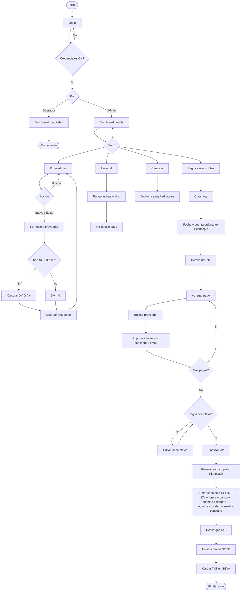

```mermaid
flowchart TD
    Start([Inicio]) --> Login[Login]
    Login --> Auth{Credenciales OK?}
    Auth -->|No| Login
    Auth -->|Sí| Rol{Rol}

    Rol -->|Operador| Usa[Dashboard usabilidad]
    Usa --> FinOp([Fin consulta])

    Rol -->|Admin| Dash[Dashboard del día]
    Dash --> Menu{Menú}

    Menu --> Prov[Proveedores]
    Menu --> Pagos[Pagos - listado lotes]
    Menu --> Hist[Historial]
    Menu --> Camb[Cambios]
    Menu --> Dash

    Prov --> ProvAcc{Acción}
    ProvAcc -->|Buscar| Prov
    ProvAcc -->|Nuevo / Editar| ProvForm[Formulario proveedor]
    ProvForm --> EsNIT{Tipo NIT 03 o 09?}
    EsNIT -->|Sí| DV[Calcular DV DIAN]
    EsNIT -->|No| DV0[DV = 0]
    DV --> GuardarProv[Guardar proveedor]
    DV0 --> GuardarProv
    GuardarProv --> Prov

    Pagos --> NuevoLote[Crear lote]
    NuevoLote --> DatosLote[Fecha + cuenta ordenante + concepto]
    DatosLote --> Detalle[Detalle del lote]
    Detalle --> AddPago[Agregar pago]
    AddPago --> BuscarProv[Buscar proveedor]
    BuscarProv --> DatosPago[Importe + factura + concepto + email]
    DatosPago --> MasPagos{Más pagos?}
    MasPagos -->|Sí| AddPago
    MasPagos -->|No| Completos{Pagos completos?}
    Completos -->|No| EditPago[Editar incompletos]
    EditPago --> Completos
    Completos -->|Sí| Finalizar[Finalizar lote]

    Finalizar --> GenTXT[Generar archivo plano Planocash]
    GenTXT --> ArmarLinea[Armar línea: tipo ID + ID + DV + forma + banco + cuentas + importe + nombre + ciudad + email + concepto]
    ArmarLinea --> Descarga[Descargar TXT]
    Descarga --> Correos[Enviar correos SMTP]
    Correos --> BBVA[Cargar TXT en BBVA]
    BBVA --> Fin([Fin del ciclo])

    Hist --> ConsultaH[Rango fechas + filtro]
    ConsultaH --> DetalleH[Ver detalle pago]
    Camb --> ConsultaC[Auditoría altas / ediciones]
```
