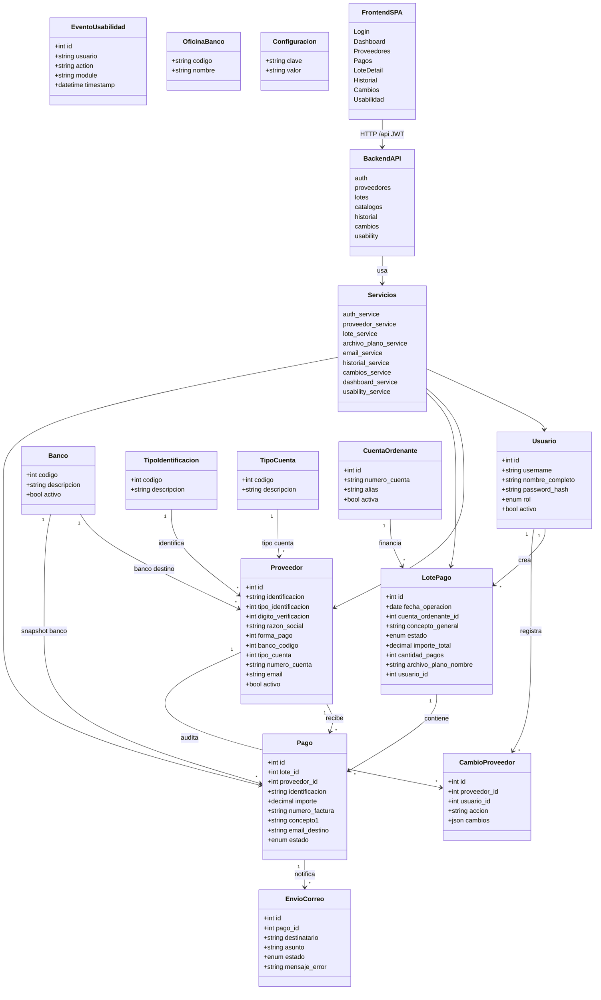

```mermaid
classDiagram
    direction TB

    class Usuario {
        +int id
        +string username
        +string nombre_completo
        +string password_hash
        +enum rol
        +bool activo
    }

    class Proveedor {
        +int id
        +string identificacion
        +int tipo_identificacion
        +int digito_verificacion
        +string razon_social
        +int forma_pago
        +int banco_codigo
        +int tipo_cuenta
        +string numero_cuenta
        +string email
        +bool activo
    }

    class LotePago {
        +int id
        +date fecha_operacion
        +int cuenta_ordenante_id
        +string concepto_general
        +enum estado
        +decimal importe_total
        +int cantidad_pagos
        +string archivo_plano_nombre
        +int usuario_id
    }

    class Pago {
        +int id
        +int lote_id
        +int proveedor_id
        +string identificacion
        +decimal importe
        +string numero_factura
        +string concepto1
        +string email_destino
        +enum estado
    }

    class Banco {
        +int codigo
        +string descripcion
        +bool activo
    }

    class TipoIdentificacion {
        +int codigo
        +string descripcion
    }

    class TipoCuenta {
        +int codigo
        +string descripcion
    }

    class CuentaOrdenante {
        +int id
        +string numero_cuenta
        +string alias
        +bool activa
    }

    class EnvioCorreo {
        +int id
        +int pago_id
        +string destinatario
        +string asunto
        +enum estado
        +string mensaje_error
    }

    class CambioProveedor {
        +int id
        +int proveedor_id
        +int usuario_id
        +string accion
        +json cambios
    }

    class EventoUsabilidad {
        +int id
        +string usuario
        +string action
        +string module
        +datetime timestamp
    }

    class OficinaBanco {
        +string codigo
        +string nombre
    }

    class Configuracion {
        +string clave
        +string valor
    }

    %% Relaciones principales
    Usuario "1" --> "*" LotePago : crea
    CuentaOrdenante "1" --> "*" LotePago : financia
    LotePago "1" --> "*" Pago : contiene
    Proveedor "1" --> "*" Pago : recibe
    Banco "1" --> "*" Proveedor : banco destino
    TipoIdentificacion "1" --> "*" Proveedor : identifica
    TipoCuenta "1" --> "*" Proveedor : tipo cuenta
    Banco "1" --> "*" Pago : snapshot banco
    Pago "1" --> "*" EnvioCorreo : notifica
    Proveedor "1" --> "*" CambioProveedor : audita
    Usuario "1" --> "*" CambioProveedor : registra

    %% Capas de aplicación
    class FrontendSPA {
        Login
        Dashboard
        Proveedores
        Pagos
        LoteDetail
        Historial
        Cambios
        Usabilidad
    }

    class BackendAPI {
        auth
        proveedores
        lotes
        catalogos
        historial
        cambios
        usability
    }

    class Servicios {
        auth_service
        proveedor_service
        lote_service
        archivo_plano_service
        email_service
        historial_service
        cambios_service
        dashboard_service
        usability_service
    }

    FrontendSPA --> BackendAPI : HTTP /api JWT
    BackendAPI --> Servicios : usa
    Servicios --> Usuario
    Servicios --> Proveedor
    Servicios --> LotePago
    Servicios --> Pago
```
